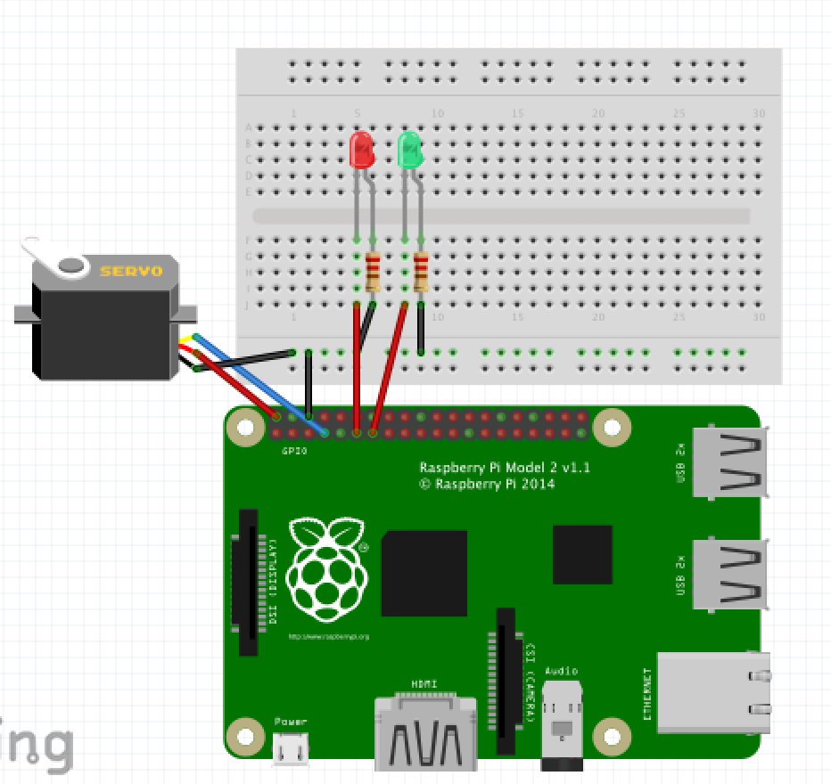

# QrLock
A Raspberry pi implementation of ZBar Based Locking system

This Poject is compatible with Python 2 & 3 and is capable of connecting with either ``` cv2.VideoCapture() or from picamera import PiCamera```
## Dependencies
* A webcam or Picamera module (Rev 1.3 was used in this project)
* zbar (Use zbar-py when installing as the default module is missing neccesary attributes)
* opencv/cv2
* pymysql
* PIL
* re 
* imutils 
* Blah for pi ver.
>This project uses an SQL Server to store Auth. Keys. So it will be neccessary to either setup a server to hold your keys and reconfigure the script change the Id storage method.
### Id Table format
|id int|name varchar(25)|pass_key(varchar(10))|
|------|------|------|
|1|"John"|"1234567890"|
|2|"Nile"|"0987654321"|
## Pi Diagram
 

### Future Developments 
* Combining Mac an Pi versions of the script with os detection
* Allow sshing into the build 